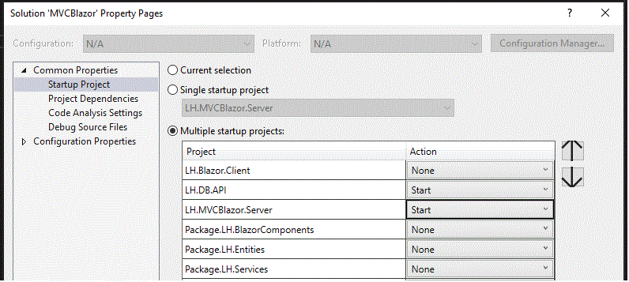

# Read Me .Md for MVCBlazor project
*This readme can be found at project top level. Here is project link [git repo](https://github.com/TechnologyEnhancedLearning/MVCBlazor)*

## About
.Net 8 MVC Blazor project, with View Components.
Has Blazor pages and MVC Blazor components.

### Setup 
*This has worked, but left in the extra steps and crossed out steps, the next person to use this setup please edit this file if they are not needed*

**Be aware AppSettings is in client too which is exposed, and we need user secrets of developer appsettings adding 
to your project to override appsettings. Use existing appsetting as a reference**
> We managed to make it work without changing the c:\Windows\System32\Drivers\etc\hosts and without generating an 
SSL certificate via the browser. In the end we didnt need to change appsettings

1. You need .net 8
**DONT run https**
1. Before doing anything look at launch setting and appsetting in the API project and the hardcoded number
	- pin them watch for changes these changes may need applying across the project
	- watch iisetting in server.properites (changes made we will want to propigate with find replace)
	- watch git changes (some things may be ignored)
	- watch browser console error
1. run each **IIS express**. ~~one at time~~. look in git compare to see changes to launch files.
	1. api
		- revert changes back when first run overwrites
	**Dont run the server project separately** (- if you do you will need to revert/update ssl port number)
		1. ~~server~~ 
			- ~~revert changes back when first run overwrites~~
	1. ~~client~~
		- ~~revert changes back when first run overwrites~~
1. then in visual studio 
	- Run drop dwon -> Configure Startup Projects -> Multiple Startup Projects. Set the following start order and targets:
		1. API | Start | IIS Express
		1. Server | Start | IIS Express
		- 
1. ~~Appsettings change baseUrl to your local host - BaseUrl stuff is just for ease in places~~
	- we are launching IIS so in launch and apisettings those are the settings that are important http, https profile shouldnt matter
1. Clean build
	- take note of routes in launch?
	- - NoJSBaseController ReturnRedirect uses the localhost address so needs changing
1. Should run but break
	- look at the console errors in browser
	- take note of launch setting route
1. Are you feeling lucky - hit run
	- If it doesnt work look in console in browser for what address it tried to hit then do a find on that to see if anything needs updating
	- in your browser bar change the address for where its trying to hit the api to what you think it should be to test it
1. Cert_Authority invalid
	- if you have this error you are hitting the endpoint :) but maybe ssl port is wrong in launch

	

### Good to know
The project has lists as a database and an API for it.
They are in a list of lists to represent some database complexity.
Currently First() is used throughout just for simplicity and only the first list in lists is used.

The project has separate controllers for NoJS to illustrate Blazor components need only a view no data (they do seed data and provide it because a mixed MVC Blazor application would want it for non-Blazor MVC elements). 
But this separation is not recommended for production or required for Blazor, it is just illustrative.

Also rendermode is passed so we can render different rendermode components off one controller this is not required
its only useful for this project in order for exploration of all the different rendermodes.

The project should work in a browser with JS disabled by using MVC to do the NoJS interactivity. 

The project has a NoJS flag so we can render one component or another based on whether JS is present. See previous commits and out of use buttons.
The expected to be preferred design is using design constraints and designed components to work for either.
The alternative is to have a NoJS flag that include prerender and static Blazor, or flags on components to not support NoJS and not render or render disabled with and explanation.
This option is not shown in this project, but is legitimate as static and prerender a component wont be interactive anyway and it wont work NoJS with being disabled.

Prerender and static wouldn't normally want to be interactive. We are using prerender to enable us to have a NoJS fallback. That is why our design will be different.

The project uses *Package.* to signify what would be a package, but actually uses references. To properly package Blazor any JS for interacting with preexisting JS and scoped CSS needs
to be accounted for as well. So there is a correct way of doing it and setting it up and several tutorials on how to do this.

We may find if Blazor is handling alot of interactivity that it is handling alot more steps in its state and then at a certain point needs to submit that state e.g. to a DB.
If currently all buttons are NoJS and every interaction is resulting in a db change then Blazor may need an additional button in its html to the NoJS, because its actions are not submitting constantly.

This project uses, and previously did so more, service collections to enable changes to packages to only be required in the package. 
This is less necessary in the case of Blazor components now that we get assemblies from _Imports where previously it was achieved by every components having dependency injection in order to avoid "tree shaking" issues.

The project has two main components. *Characters* *Attendees* this is to illustrate generic components for which *characters* is the example, and LH specific which is *Attendees* following how they differ and when a generic component is used in a LH one 
should illustrated how the separation could be handled. 

#### Good to know about Blazor
- Blazor require JS for its lifecycle stages after the initial render. The JS is to set up the WASM for Client side or SignalR for serverside.
- Blazor can be made to interact with prexisting JS and be triggered by other components or manipulate other components. This project does not cover this.
- Blazor components, base components, are not out of the box designed to work without JS. This means validation from models, and forms and other elements need to be created
to be built upon.
- Components do not know how they are being rendered.

### Purpose
- Attempt unified hosted .net 8 webapp application **this was not possible**
	- The project uses MVC Server that serves blazor pages, mvc pages, and mvc pages with blazor components
	- The project uses a client project this enables all the components and pages to be Server or Client side
		- in the case of the full blazor pages they can be full auto
			- (Components cant be interactive auto if served via component tag in MVC, they can be all the other render modes)
	- Layout is not shared between MVC and Blazor pages. Its duplicated. In the example it shares NavMenu. Which is 
the bit most likely to be updated.
	- We can have the same routes for blazor and MVC they do not need separate domains
- Explore challenges of adding Blazor to MVC Views
	- No interactive auto but everything else
	- can pass class, list, booles, etc
	- cannot pass complex things like render fragments (there are ways such as making them strings but I don't recommend them)
		- Instead we can make a component specific to the scenario
		- Another more flexible but complex option would involve a more generic component that receives instruction 
on what to create (like a factory, I don't recommend this for now, though there may be scenarios)
		- designing to avoid render fragments where possible
- Attempt to consume and recreate some nhsuk design components **works, nojs support requires prerender and our own base components**
	- radiolist component
		- works noJs
		- works blazor
		- similar html structure could be the same
		- validation works could be further improved to be the same as VC in noJs scenario
		- ViewState can be passed
		- **Moved from shared interface to event passing this may be a choice worth further consideration**
- Ease in adding components **Yes**
	- Components can be added to projects and via service collections when made into packages would automatically be available as long 
		as the package was updated (currently the project uses project references for ease)
- Ease in creating components **Should be ok except for base components (due to nojs requirement)**
	- components should be easy to create
- Explore challenges of adding Blazor to MVC and converting View Components
	- Some viewcomponents do not support separate naming of inputs and endpoints or nested models
		- Models being created for use with blazor will need to work for VC as well.
- Create highly separated architecture to enable decision making **Yes**
- Create project such it can be used as a way of trying out blazor **Yes**
	- Has colour coded blazor and mvc pages
	- Has pages for different render modes
	- Has Views
	- Has pages
	- Has data and services with enough complexity to see where shared logic, models may occur
- An architecture that is a starting point for deciding how Blazor will be intergrated and be made sharedable with the design system
	- We don't have packages but we do have references currently for ease
		- There are certain ways of packaging that need exploring and the way css, js (for interacting with none blazor components) has not been explored.
	- We do have a component that is an example of LH specific (Attendees) and one that is Generic (Characters) so 
we can see how both are consumed. Related and at what point the generic gets wrapped into an LH component.

### Quick context on NoJS requirement

Blazor is not designed for NoJS but can be made compatible with it by creating our own versions of basecomponents that work in prerender.
Then future components should only need to provide a few additional parameters such as post routes.
These routes in this project are put on a seperate controller to show they are only required by NoJS. 
And the controllers use the same service the component does so NoJS or interactive the same functionality is used but one uses the controller and one uses the component to do it.

There is also a difference in how state is handled. 
And state is an area that should be examined in detail.
There are options like mediatr package and patterns with an API to centralise state.

In this project the approach is for NoJS the state is the database their is no intermediate state.
This means every change is submitted to a controller which uses a service to hit an api and make the change.
This requires specific controller endpoints just for NoJS, and specific database services and api endpoints just for NoJS.

Components will handle a certain amount of state within themselves.
Then post when they are finished. This means less API calls.
It may also mean we want in future some dispose options for sending state or warnings about losing data if navigating away.
It also means UI differences from NoJS. If a component has a post for every change that goes to the DB in NoJs it will need no final submit button.
But the blazor component handling state itself will need a final submit button for when data is to go to the DB.
This is something we would want a design principle for. As we want our NoJS html to be as much as possible identical to our interactive html.
But we don't want forms in forms.

We need to also decide if we want to keep state in services at all.
With thought to when "circuits" cause new services to be created and how that works with MVC hosted blazor components.
It may be best to have stateless services and API and stateful components, for simplicity.
It seems extremely likely that the services would not be useable in such a way to persist state across components and controllers meaningfully.
There is also added complexity from services existing both in WASM and Server if using Webassembly.

Further reading DLS NoJS requirement: [confluence nojs dls](https://hee-tis.atlassian.net/wiki/spaces/TP/pages/3546611779/Search+sort+filter+and+paginate)

### Explanation of Rendering
Blazor can render Server side via a SignalR connection it makes to update the UI and be interactive.
This work is done on the server. To set up the connection JS is required.

Blazor can render via the browser. This is WASM which is compiling the code to webassembly which the browser uses.
The work is done by the browser. You write no JS but it does require it again for set up.
WASM requires a seperate client project, which means it also is injecting its own version of services to the server.

Blazor can also stream render which is progressively rendering sections of pages. This needs JS and is not useful for us.

Blazor has other options such as Interactive Auto, (we cannot render this way with components provided by the view).
With interactive auto we first render pages serverside which is quicker. Then automatically move to WASM once its uploaded to their browser.

There is also Static, static just puts up the html. Though its static in our case it probably won't be if we have posts built in to out html for 
NoJS requirement.

~~From these WASM for components renderered in views and interactive auto for pages seems the most desireable.~~
Initial discussions suggest WASM Prerendered globally is the best option. This requires a little more set up as we need a client project.
The work is done by the browser and quickly, the prerender is done by our server. So the prerender and WASM will inject their own version of services (ussually identical).
The prerendering giving us NoJS functionality.

Prerendering is an option for WASM, Server, Interactive Auto. We would want to use prerendering.
Prerendering creates first a static page. This is good for SEO and providing quickly an uninteractive UI initially for the user
rather than waiting for loading. It should exist for a very short time. 

We are interested in prerendering because Blazor can prerender without JS. The prerender is just the static rendering.
Which means if a user has nojs they get the static UI. Which can be interactive via html with posts etc.

In this project we inherit from a base component and inject a service to tell the component if JS is enabled.
~~If it isn't we will render some components differently~~ (We now have components that do both without a split).  Ideally we should aim for components that are exactly the same
in NoJS and that seems possible as with refactoring it has become increasingly the case, and design decision can be made to support this.
If we don't prerender and a user does not have JS they will see nothing. A way around this is to have the JSIsEnabled in the views and render 
a different component, but this has not been explored as a desireable option here as we dont want to duplicate all top level components though may accept having
some base level NoJS components.

The prerender rendering stage is followed by other lifecycle stages which "hydrate" it with functionality and rerender.
When we provide elements like an *EditForm* with a post, the post will work in the prerender phase giving us our NoJS functionality if there are no further phases.
When the component is hydrated and a service/event is applied to the form this functionality overrides the post.
This means we can avoid having a seperate NoJS element and an interactive element. This approach is what we would hope to acheive we all elements.

Using prerender in this way does introduce some challenges/opportunities.
- If it is a blazor page, we are not passing it a view. Therefore we will not return validation to it, and so to handle more than html validation we must redirect to an MVC page
- Prerender is static, and we are putting in functionality to allow it to operate no js if a user is quick enough they could use the UI nojs functionality (currently we don't track render stage or mode so it will break where 
a NoJS flag is used to provide a different component. But this flag could be changed to track NoJs Prerender 
lifecycle stage or static render mode )

- prerendering using an injected service will receive the server side version of that service, even if it is rendered WASM and is hydrated with WASM version of a service.
- there is built in a lifecycle render stage with a provided first render flag that is likely to be useful.
- the intention should be for prerender html to be as close to the hydrated version as possible so the screen does not flicker.
- we dont have to prerender everything we can have loaders that wait until lifecycle stages that happen after prerender
- Anything *Async* that updates after initial render will not happen in NoJS because lifecycles top after rendering.

### Further Information
The project did have all the view components in and css in previously. 
It has been refactored out for convenience mostly but did work. See [Some commit may need reverting but can be found in older git repo in previous commits](https://github.com/TechnologyEnhancedLearning/MVCWebApp)
- [View Components and Blazor](https://hee-tis.atlassian.net/wiki/spaces/TP/pages/4489314319/View+Component+Compatibility)
- [Confluence on tree shaking (as solved in project less useful now)](https://hee-tis.atlassian.net/wiki/spaces/TP/pages/4489347088/Tree+Shaking)
- [Confluence NoJS requirement (Also covered in this doc as the main potential factor that could have resulted in not using blazor) ](https://hee-tis.atlassian.net/wiki/spaces/TP/pages/4488888331/NoJS+Requirement)
- [confluence reference for this project](https://hee-tis.atlassian.net/wiki/spaces/TP/pages/edit-v2/4302503949)

## Exploration of Project

### Design
#### Architecture
[Bottom file tree diagram of solution](#folder-structures-and-comments)
It is common to have a shared project that both WASM and Server rely on. For us we could bring in all our packages by it a injection collection potentially.
But for now it is only a nicety that could make the project seem more complex. So is not included.

*There are also Test. projects these are purely for testing the BUnit and Blazor functionalities. And are not representative of what would be used in production.*

##### Objective of Architecture
- Minimal change to implement components
- Reusability
- Evidence can support all Blazor options
	- Pages
	- WASM
	- Server
	- Auto
	- Streamrendering (This one I dont think is useful to us)
	- Static
- Design intentions
	- Slim WASM
	- Minimal repetition through injection collections
	- Minimal boiler plating in MVC project to add new package component
		- Via injection collections and version number hope to be able to implement new components being available 
without having to do anything except add the component you want to use in the place you want it.

##### Structure

**Out of scope** - Dependency Diagram, Table explaining why and what each project in solution is for

*Note: .Server here is the equivalent of WebUI in LH. Its serving the View Page, Blazor Pages and WASM (view the client which is just the wasm that goes onto the users browser)*

LH.Server and LH.Client have references to all the packages with Server also having a reference to Client.
Shared Services has a reference to Shared Entities and Shared BlazorComponents has a reference to the other two Shared packages

This is the same with the LH packages. Which in addition have a reference to the shared packages. 

The API does depend on some service interfaces they may be in the wrong place.

##### Naming
In order to easily identify where components come from so we can see how general components are used within LH 
components for example a lot of files have a suffix.
So LH_CharactersDBService : IGS_CharactersDBService
Means the implementation is specific for learning hub the but this service is from the general/generic package
so characters simulates a generic component/service of some kind. (Attendees is very similar but represents a purely LH one).

	- LH (learning hub specific generally used for services and entities at times)
	- Package (We are using references but this indicates the project would be a package)
	- GB_ blazor generic
	- LHB learning hub blazor
	- GE_ generic/shared entities
	- GE_VCB view component blazor
	- _I means interactive (want to move away from this)
	- _S means static e.g. nojs (want to move away from this)
	- G_ generic
	- VCB_ viewcomponentblazor
	- P_ .txt placeholder example what might go there but is out of scope
	- GS_ generic services
	- LHS_ learning hub service
	- T_ used just for testing not as an example for instance checking BUnit feature

### Files what to look at
**Tip if on git view the readme as raw a code file and open with markdown plugin and set to wide**
[Bottom file tree diagram of solution](#folder-structures-and-comments)

### Testing

**Nb. There are failing tests throughout these show the limitations of our tests currently, and what we would like 
them to achieve so do not worry if a fresh project has failing tests.**

In this project we are not covering the unit testing that would happen already. 
Therefore there is no testing of services or controllers etc.

**TODO: One example because nojs is not simulated in unit tests for rendering but mocking controlls may make more 
tests capable of both **

Ideally we would be able to side by side be able to test our components in the NoJS environment and with JS Enabled, by html comparison or static rendering for example.

To be able to test the actual render output of a NoJS browser we need tests that can render static, or render using a nojs browser.
This is because the lifecycle stages are different and are ordered different to the normal process (asyncs for example are awaited as there will be only one render).

The project uses the recommended XUnit, BUnit, FluentAssert, AutoFixture.

However the creator of BUnit who recommends XUnit for E2E recommend Playwright and NUnit.

In this project we unit test the blazor component packages, we also have some components created just to be unit tested.
This is so we have some examples of the different BUnit methods.

#### Unanswered Questions
- How do we get test coverage
- better way than string comparison for bunit surely

#### Testing to do
- document advice for creating tests to go with component advice
- When sessionstorage there are specific tests
- When js interoptobality there are specifics tests for it
- controller
- E2E

#### Unit Test BUNIT

BUnit uses testing packages we already use such as moq xunit autofixture.

It complete a render cycle of a component.
It handles async allowing us to tell test to wait until something occurs [bunit async](https://bunit.dev/docs/interaction/awaiting-async-state.html)
It can compare nodes after events [IDiff check](https://bunit.dev/docs/verification/verify-markup.html#finding-expected-differences)

BUnit seems like a good unit test library with good documentation.
It does not allow lifecycle, rendermode controll of the component or its test context which is problamatic for testing our NoJS requirement.

In the example project we are using a fallback provider [fallback service provider](https://bunit.dev/docs/providing-input/inject-services-into-components.html#fallback-service-provider)

[node comparison, snapshot, click, compare](https://bunit.dev/docs/verification/verify-markup.html#finding-expected-differences)

The Units Test file structure mirror what they are test.
The RenderComponent is better than render.
We can wait for tasks to complete cut.WaitForAssertion(() => cut.MarkupMatches("<output>3</output>"));

#### BUnits Notes
- bunit .net9 allows to alter renderinfo not rendermode so not behaviour ... .Net 10? to do our nojs requirement in BUnit?
- Maybe instead dependency injection extension do TestContextExtensions like blazor-workshop egil git
- We can also pick up inneffecient rendering such as
`
        diff.ShouldHaveSingleChange();
        //Getting 596 this indicates I am inefficiently rerendering possibly because i should have used key?
        //This is an advantage over just comparing string
        var diff2 = cut.GetChangesSinceFirstRender();
        diff.ShouldHaveSingleChange().ShouldBeRemoval(firstRemoveButton.ToString());
`
##### BUnit Reference
Creator of BUnit testing project and step by step, I think there are some long video accompaniments [not .net 8 but bunit repo](https://github.com/egil/blazor-workshop.git) 
[wait for state covered in medium article for bunit](https://dev.to/webinadvance/unleashing-the-power-of-unit-testing-supercharge-blazor-server-async-components-ui-behavior-with-net-core-and-bunit-4n9j)
*Egil is the BUnit creator*
- [list blazor githubs some have unit tests](https://github.com/AdrienTorris/awesome-blazor)
- [egil conference tests](https://www.youtube.com/watch?v=aorfcDeHUpw)
- [pizza egil git](https://github.com/egil/blazor-workshop/blob/master/src/BlazingPizza.Tests/ComponentLibrary/PizzaCardTests.razor)
- [useful for understanding comparer options for markup in bunit](https://bunit.dev/docs/verification/semantic-html-comparison.html)

##### Carpark Test Examples
- cut.Nodes.QuerySelector("main > span");
- `    cut.FindAll(".list-group > .list-group-item > p")
            .Select(x => x.TextContent)
            .Should()
            .BeEquivalentTo(data);`
- `

        cut.Find(".list-group")
            .ClassList
            .Should()
            .Contain(listGroupClass);
`
- `       pizza.Toppings
            .Should()
            .Contain(x => x.Topping == toppings[0]);
        pizza.Toppings.Count
            .Should()
            .Be(1);`
- `
    [Theory, AutoData]
    public void When_PizzaRemoveButton_Is_Clicked_And_Confirm_Dialog_Accepted_Then_Pizza_Is_Removed_From_Order(
        Order order)
    {
        SetupRemovePizzaConfirmCall(order.Pizzas[0], acceptRemoval: true);
        var cut = Render(@<OrderInformation Order=order />);
        var configuredPizza = cut.FindComponent<ConfiguredPizzaItem>();
        var pizzaToRemove = configuredPizza.Instance.Pizza;

        configuredPizza.Find("a").Click();
        
        order.Pizzas
            .Should()
            .NotContain(pizzaToRemove);
    }

`
- `    [Theory, AutoData]
    public void PizzaCard_Raises_Clicked_Event_When_Clicked_By_User(PizzaSpecial inputPizza)
    {
        PizzaSpecial? clickedPizza = null;
        var cut = Render(@<PizzaCard Special="inputPizza" OnClick="pizza => clickedPizza = pizza" />);     

        cut.Find("li").Click();

        clickedPizza.Should().Be(inputPizza);
    }`
- `
   [Theory]
    [InlineData(".sorted-by", true)]
    [InlineData(".sorted-by-desc", false)]
    public void DataTableHeader_Adds_Sort_Css_Class_To_Sorted_Column(string expectedCssClass, bool isAscendingSort)
    {
        // Render DataTableHeader with sortBy set to last column
        var cut = Render(@<DataTableHeader TItem="WeatherForecast" 
                                           SortBy=@(("Summary", isAscendingSort)) />); 
        
        // Verify the correct column has the expected css class added
        cut.FindAll(expectedCssClass)
            .Should()
            .ContainSingle()
            .Which
            .TextContent
            .Should()
            .Be("Summary");
    }
- `
Testing with regex rules
  

`

##### NoJS BUnit testing
- There is an image in the project, and a test component showing the difference in rendering between prerender, static/nojs, and full render.
Prerender is required to get any html NoJS but prerendering with JS Enabled returns less stages than if in NoJS environment where a few other are awaited.
The rendering happens in a different order if there is JS. 
This means we need to specifically test in a Static rendermode, or control which lifecycle stages occur

##### Additional information of BUnit NoJS Lifecycle testing limitation

###### BUnit nojs graveyard
- builder.OpenComponent<JSTestSetupTestComponent>(0);
- noContextNeeded.Render(@<JSTestSetupTestComponent />);
- `   cut.SetParametersAndRender(parameters
       => parameters.Add(p => p.ProvidedRenderModeText,
           "Rerender new params"));
   string NoJSMarkupStringAfterAwait = cut.Markup;`
- cut.OnMarkupUpdated += (sender, args) => markupStringLs.Add(cut.Markup); We dont get the same execution order so 
we cant just interupt the process of rendering or catch it at a certain point.
-    var diffs = cut.GetChangesSinceFirstRender();

###### Attempted to overcome nojs testing limitiation
- RenderInfo is just info does not change how set up
- Capturing all changes to html with lifecycle stages, but it is different order its not just a case of additional stages if JSEnabled
- Different ways of rendering tried
- JSInterlop this isnt the JS setup it is the JS interactivity of a component only
- Various other
- Attempting Mocking and overriding lifecycle stages 
	- This was not succesful but it might be worth exploring seperating C# and razor to attempt to use a mock to render the razor
		- I dont know how this would be done but if the same razor, different implementations of a class so can mock
		- or instead of mocking the component just the class part
`
@using Microsoft.AspNetCore.Components.Rendering
@using Package.Shared.BlazorComponents.UnitTests.TestComponent_Example
@inherits JSTestSetupTestComponent
@*Attempted to stop lifecycle stages to get NoJS Behaviour*@

@RenderBaseComponent
@*This will be the actual component and we cant inherit the razor so this wont do anything*@

@code
{
    protected override void OnAfterRender(bool firstRender) { }
    protected override Task OnAfterRenderAsync(bool firstRender) => Task.CompletedTask;
}

`
###### For future consideration Testing NoJS possible solutions
- BaseComponent NoJS flag to pass a bool to Lifecycle stages and return straight out of them
	- We should not change components to support testing
	- We may still require inheriting components to have changes I expect where they use these lifecycle stages
- Use E2E only to test Static
- Don't render with BUnit for these tests
	- Explore making a static Blazor project and attempt turn it into a test project
- Explore BUnit more under the bonet
	- Can we make a custom IRenderer for a custom ITestContext and in somewhere can we chose rendermode (I expect not)
- November 25 Investigate .Net 10 it maybe be our unit tests can be a higher version and .Net 9 introduced Render 
info so it might be component have an explosed rendermode and BUnit may then implement it. 
- Explore rendering components from component classes to see if more control
- Look at other testing packages
- Look into page rendering
- Return to component tag rendering which does allow specifying rendermode
- Return to exploring rendertree manual rendering options
- If we make rendercycle methods public we can then trigger them, however though we can get prerender html we cant 
get the actual component at the moment of that state so we will be calling addition lifecycle stages not restricting them
	- Though maybe they can be mocked to return nothing

#### E2E Testing: Playwright?
- When we look at further testing we should revisit BUnit limitation and attempt to create a process for Unit 
testing static or NoJS browser or specific lifecycle stages so that the NoJS requirement is easy to test side by side with JSEnabled.
- Egil BUnit library creator suggests Playwright with NUnit rather than XUnit
	- Also for us normally we would be 90% Unit 10% E2E as its packages however to enable testing NoJS along side tests for normal functioning it may need to be the other way around.

#### Testing Naming/Glossary
- T_ components purely for test
- Mock: A "mock" is typically a test double used to verify interactions, i.e., whether a method was called with the 
right parameters. You generally use Mock when you expect the test to assert that the behavior of the object meets 
certain expectations (e.g., checking that a method was called a certain number of times).
- Fake: A "fake" provides a working implementation but simplified for testing purposes. Fakes are typically used 
when a more complex behaviour is needed, but you don't want to call the actual logic in production. They are useful 
for things like in-memory databases or simplified versions of service methods.
- Dummy: A "dummy" is a test double that is passed around but never actually used. For instance, you might create a 
dummy to satisfy the constructor signature of a class when you don’t care about the object’s behavior.
- Spy: Tracks interactions with the object while allowing the real method to execute.
- Stub: Returns predefined responses, usually with no logic, to isolate the unit under test.

#### TODO: Profiling

## Project Limitations and Potential Future Additions

### What does it not show
- It is not an example of best practice it is an exploration of what may be worth discussing and evaluating as an approach.
This project is not currently a reference for how to but an example of what can work and may have potential.
- shared layout between Blazor and MVC pages. Blazor has to have its own duplicate of it.
- Safe routing we just whitelist the blazor pages at the moment
- NoJS controller and reroutes is probably not how we would do it, but is illustrative of what blazor does and doesnt need and what is just for nojs

### Desired Future Additions
- Explore ids, will guids result in more testability or will it cause less matching and so more rendering? what is best id practice.
	- These handles will be vital for testing
	- also keys for lists
	- functions passed on how to grab the key would be good 
		- so value types can have one rule
		- blazor objects could have a get key interface - currently have a clientid 
		- objects from elsewhere can pass own func for providing a key which may just be their type + an id
		- just some helper code may consider may not 
			- `return $"{typeof(TItem).FullName}-{item.GetHashCode()}"; 
			KeyProvider="(item) => item" `
- Add ErrorBoundary example in somewhere
- Extract the add person to a generic component - We would also need the JS supported inline validator so do as an addition
- StateService 
	- should have an Event Action Subscription and handling it all in the service ensure no list of data in the components
		- Different components via MVC view means losing the circuit and the state but only needed for component life 
	- Revisit stateservices to include  public event Action AttendeesChanged; subscribe statehaschanged to this
		- all handling occuring in state service
		- added some failing unit tests
		- also need to check enough use of @key
		- also need to check no rebuilding the list
		- also it may not be possible and what currently seems an inefficiency maybe okay
			- yet if the out of the box list component can do it, we want ours to be just as efficient
- Auth headers and auth tokens in blazor see [This patrick god ecommerce repo does have and there is a confluence project for how to set it up](https://github.com/patrickgod/BlazorEcommerce)
- blazorisedStorage
	- nojs api calls from controller
	- so we dont need to check nojs before deciding if to use localstorage or hit api
	- so we can use localstorage to reduce calls

- Loading behaviour [repo link](https://github.com/patrickgod/BlazorLoadingAnimation)
	- Loader [repo link (there a youtube vid with it i think)](https://github.com/patrickgod/BlazorLoadingAnimation) 
- Components render in views are islands. They can't talk to each other. Unless
	- Mediatr package maybe
	- Subscribe each others events maybe
	- May need a dispose function so state not lost but instead saved on destruction
	- Or Blazorised storage may be the actual best solution

### Desired For Different Prototype Or Branch
- packaging (may find package building package options removes need for service collections)
	- scoped css in packages
	- js wrappers being introduced for js triggerable blazor
	- gulp process
	- some resources	
		- [blazor uni component libraries](https://blazor-university.com/component-libraries/)
		- includes getting style sheets [microsoft class libraries](https://learn.microsoft.com/en-us/aspnet/core/blazor/components/class-libraries?view=aspnetcore-8.0&tabs=visual-studio)		
- Mediator state manager
	- revisit mediatr package
- **important** -> prototyping tools

### Car park desired features
- storage consideration of unencrypted on the browser
- persistence for
	- user prefs
	- auth tokens
	- incomplete forms
- we use reddis already explore this with blazor as they do get mentioned together
- offline capabity - WASM gives us a certain amount of offline capability. Can we weight that up as more important than nojs capability.
- fluxor and redux state management mentioned in a course to look at for complex requirements
- i doubt its possible however if a user had nojs and we provided a button to download the wasm and instructions how 
to put it on their browser would that be requirement met? It would most likely be very complex.
- .net 9 has RendererInfo (would need to look into it further) which include isInteractive and rendererName
	- Our service says the name of the platform so we have this already
	- does have an isineractive flag which could be useful to indicate JsEnabled potentially
- ILogger (when do search component may be a good can test for example that we log when ppl look for things that arnt found) [ilogger](https://bunit.dev/docs/misc-test-tips.html#capturing-logs-from-ilogger-in-test-output)
	- serilogLogger
	- Similar to LH setup
	- Included in tests
### Approaches Discarded For Now
- Improve validator component [try this blazor uni in future](https://blazor-university.com/forms/writing-custom-validation/)
	- Uses fluent validation, which requires JS, so maybe not, attributes are better
	- Refactoring the approach used here to combine viewstate and blazor validation may be better
- use layoutcomponentbase for render pages. This has been explored and because Layout is stripped for MVC 
components. And at least for component based rather than global rendermode settings it seems to need to be static. 
It does not seem to be useful to our needs on first look. 
	- read [Didnt work but worth more investigation for interactive layouts](https://stackoverflow.com/a/78574209/22951851)
	- maybe layouts need to be passed by a view if consuming pages as components??? 
	- this could be important as its nice to change the layout based on admin privilege for example (if we were doing pure blazor page approach)

## Recommendations from project
In no particular order.
- I think from discussions webassembly prerender will be the choice. Without blazor pages. And keep this project as reference if we want to introduce them.
- currently we do not have interactive layoutcomponents this is done via the header and route render mode being set in the app
	- if we do blazor pages we should avoid all but the MainLayout as layout and rendermode are stripped when MVC renders MVC pages as components
- if all buttons are to work NoJS and for ease of not splitting to two implementations of html. Use *EditForm* with submit buttons for all buttons. and onsubmit will be overriden by blazor.
This will require buttons to not be used within EditForms at all (excluding a forms submit). This way it can be NoJS compatible
- Elements need to work without JS without the NoJs flag so Prerender and static work too. 
	- Or we need the NoJS flag to also be triggered by prerendering and static.
	- Or we disable static and prerendering it NoJS flag is false so they are truly static
		- NoJs false disable submit buttons and enable on hydration
- Splitting implementation for NoJS should be a last resort. First try:
	1. can we wrap in EditForms
	1. can we override functionality in hydration
	1. can we disable in prerender and static
	1. last resort different html rendered for NoJS
- Controllers should use same service as blazor components so posts using same logic
- Remake all default blazor components in our own way
- Blazor does not know what ViewState is so we need pass it. In the project we have an interface for models and a 
custom validation component to handle modelstate validation and Blazors validator component.
- ~~Separate VC model requirements into set of interfaces~~ (Instead when making models ensure work for the equivalent component too and keep them as flat as possible)
	- This could work but we would need to put the interfaces on viewmodels, form models, but not just models as we are mixing UI in
	- It requires alot of change
	- This project has moved to passing events without the interface this does mean compatibility is not forced, and we could provide helpers but currently
	on creating the component it needs to be told how to consume the data.
- Warning NoJS requirements require alot of considering and work
	- How components are designed
	- Still needing View controllers to handle functionality
	- Require prerendering (which we may of wanted anyway)
	- More service methods because need to be able to use db as only source of state if needs be
	- Custom base components
		- Lose opportunity for baked in simplicity of some quality of life features like 2 way binding (EditForm with EditContext instead of using the Model results in more complex more manual defining of events rather than leveraging two way binding)
		- Another example passing EditForms a Model is so much easier than editcontext, but we need to do it this way due to custom handling
	- Restriction in Blazor functionality can use, such as quality of life features and more complex approaches that should not be leveraged where we need interactable static renderered html.
- ViewComponents and MVC like flat models for ease Blazor requires less event handling and complexity when no using nested classes because reference changes are harder to track.
- Make all default base components first and as well as we can
	- Then make versions of viewcomponents on them and refactor to make it fit their needs 
- Better base components easier everything else. Also if they require to be changed in the future it may require a lot of testing as all the components that use them may need testing.
	- However we may have unit tests
- Have a browser set to NoJs for testing components
- Decide together on a global rendermode current thinking is webassembly prerender
- Get input from team with lots experience of LH and get input on opportunities and problems may face with Blazor specific to LH etc
- Take advantage of C# features and consider compliance interfaces

### Recommendations if want Blazor pages
- If we want to redirect from blazor pages for nojs use nojs script tag and meta tag to redirect. This is because we 
run the code as we prerender, using 
navigationmanager in prerendering stages will happen 
before render. even if async. which means we cant show 
html like "you have no js your being directed" on our 
blazor pages. Though we can still use the navigation manager to redirect it just can't happen after prerender.
It would be possible to tell them they we're redirected on the page they we're redirected to if this was preferable.

## Trouble Shooting
- if assembled files break try deleting them and then starting
- blazor not detecting any components! - restarted visual studio i was running two instances for comparison
- deleting auto generated files when some issues due to references seems to work even after bin and obj deletion and clean for this kind of error 
	- expect when using packages some of these issues will resolve
- We have an IAccessible interface for our components leveraging C# functionality is an advantage of using blazor so we should see where it can be implemented
	- This project does do this, though it is necessary to chain the parameters down through the components, which means the summaries are lost.
	There is probably a better way of doing this. It may be with cascading. It maybe with inheritance rather than interfaces.
- careful of moving razor files between projects
- changing a component to server rendering can allow you to debug in vs a little easier

## Things to try in the project to gain familiarity
- replace the li links with a blazor component that takes class the href or two one for mvc and blazor

## Folder Structures and Comments
### Project Structure

|  Description  | File Structure  |
|----------------|-------------|
| Centralised Packages at this level  | &#9507; MVCBlazor |
| Slim Client for WASM, needs an **exposed** appsettings, could have a shared.proj for all services packages for server/wasm to be centralised | &#160;&#160;&#160;&#160;&#9507; LH.Blazor.Client |
| Requires same services, can be different implementation to Server | &#160;&#160;&#160;&#160;&#160;&#160;&#160;&#160;&#160;&#160;&#160;&#160;&#9495; Program.cs |
| Simulated a db, additional endpoints to support nojs | &#160;&#160;&#160;&#160;&#9507; LH.DB.API |
| Controllers for general and lh services | &#160;&#160;&#160;&#160;&#160;&#160;&#160;&#160;&#160;&#160;&#160;&#160;&#9507; Controllers |
| rough ready crud just for prototype | &#160;&#160;&#160;&#160;&#160;&#160;&#160;&#160;&#160;&#160;&#160;&#160;&#160;&#160;&#160;&#160;&#160;&#160;&#160;&#160;&#9507; LH_AttendeesDBController.cs |
| rough ready crud just for prototype  | &#160;&#160;&#160;&#160;&#160;&#160;&#160;&#160;&#160;&#160;&#160;&#160;&#160;&#160;&#160;&#160;&#160;&#160;&#160;&#160;&#9495; LH_CharactersDBController.cs |
|  | &#160;&#160;&#160;&#160;&#160;&#160;&#160;&#160;&#160;&#160;&#160;&#160;&#9507; Data |
| | &#160;&#160;&#160;&#160;&#160;&#160;&#160;&#160;&#160;&#160;&#160;&#160;&#160;&#160;&#160;&#160;&#160;&#160;&#160;&#160;&#9507; ISimulatedDatabase.cs |
|  Lists of list ready to support more complex components | &#160;&#160;&#160;&#160;&#160;&#160;&#160;&#160;&#160;&#160;&#160;&#160;&#160;&#160;&#160;&#160;&#160;&#160;&#160;&#160;&#9495; SimulatedDatabase.cs |
| Dependency Injection Collections so changing packages or apis not require program.cs changes in Client or Server  | &#160;&#160;&#160;&#160;&#160;&#160;&#160;&#160;&#160;&#160;&#160;&#160;&#9507; DependencyInjection |
|  | &#160;&#160;&#160;&#160;&#160;&#160;&#160;&#160;&#160;&#160;&#160;&#160;&#160;&#160;&#160;&#160;&#160;&#160;&#160;&#160;&#9495; DependencyInjection.cs |
| Just allowing calls from other projects | &#160;&#160;&#160;&#160;&#160;&#160;&#160;&#160;&#160;&#160;&#160;&#160;&#9507; Program.cs |
| Rough ready crud, **warning** uses First() currently for ease | &#160;&#160;&#160;&#160;&#160;&#160;&#160;&#160;&#160;&#160;&#160;&#160;&#9495; Services |
|  | &#160;&#160;&#160;&#160;&#160;&#160;&#160;&#160;&#160;&#160;&#160;&#160;&#160;&#160;&#160;&#160;&#160;&#160;&#160;&#160;&#9507; LH_AttendeesDBService.cs |
|  | &#160;&#160;&#160;&#160;&#160;&#160;&#160;&#160;&#160;&#160;&#160;&#160;&#160;&#160;&#160;&#160;&#160;&#160;&#160;&#160;&#9495; LH_CharactersDBService.cs |
| No blazor components, minimal pages setup (its in LH.components). Moving all to LH.Components could be desirable. Also messy properties folder CSS handling not a focus of project. proj.cs has _Host commented out. | &#160;&#160;&#160;&#160;&#9507; LH.MVCBlazor.Server |
| Project has blazor components and pages with own routes with shared server domain. | &#160;&#160;&#160;&#160;&#160;&#160;&#160;&#160;&#160;&#160;&#160;&#160;&#9507; BlazorPageHosting |
| Used for all @using to avoid tree shaking through getting the assemblies here *May be unnecessary for all @usings to be in the _Import files* | &#160;&#160;&#160;&#160;&#160;&#160;&#160;&#160;&#160;&#160;&#160;&#160;&#160;&#160;&#160;&#160;&#160;&#160;&#160;&#160;&#9507; _Imports.razor |
| Our interactivity is component based not global currently app.razor is static rendered potentially this could change with global rendermode | &#160;&#160;&#160;&#160;&#160;&#160;&#160;&#160;&#160;&#160;&#160;&#160;&#160;&#160;&#160;&#160;&#160;&#160;&#160;&#160;&#9507; App.razor |
| None of the files in this folder except this one needed if we are rendering components only from views | &#160;&#160;&#160;&#160;&#160;&#160;&#160;&#160;&#160;&#160;&#160;&#160;&#160;&#160;&#160;&#160;&#160;&#160;&#160;&#160;&#9507; App_this_Works_If_We_Dont_Want_Pages.razor |
| Notice routes references own blazor layout mvc and blazor cant share this | &#160;&#160;&#160;&#160;&#160;&#160;&#160;&#160;&#160;&#160;&#160;&#160;&#160;&#160;&#160;&#160;&#160;&#160;&#160;&#160;&#9495; Routes.razor |
| For Blazor components needs only really need to render the component no parameters | &#160;&#160;&#160;&#160;&#160;&#160;&#160;&#160;&#160;&#160;&#160;&#160;&#9507; Controllers |
| NOJS controllers not a production recommendation just to show what is specifically for nojs requirement | &#160;&#160;&#160;&#160;&#160;&#160;&#160;&#160;&#160;&#160;&#160;&#160;&#160;&#160;&#160;&#160;&#160;&#160;&#160;&#160;&#9507; Attendees_NoJSController.cs |
| This controller has an additional endpoint just for seeing that blazor pages can be rendered as if they were components | &#160;&#160;&#160;&#160;&#160;&#160;&#160;&#160;&#160;&#160;&#160;&#160;&#160;&#160;&#160;&#160;&#160;&#160;&#160;&#160;&#9507; AttendeesController.cs |
| | &#160;&#160;&#160;&#160;&#160;&#160;&#160;&#160;&#160;&#160;&#160;&#160;&#160;&#160;&#160;&#160;&#160;&#160;&#160;&#160;&#9507; BaseControllers |
| Blazor pages work upto a point nojs, we can return incomplete data to them e.g. validation. we can rerender them and their services refetch db changes.   | &#160;&#160;&#160;&#160;&#160;&#160;&#160;&#160;&#160;&#160;&#160;&#160;&#160;&#160;&#160;&#160;&#160;&#160;&#160;&#160;&#160;&#160;&#160;&#160;&#160;&#160;&#160;&#160;&#9495; NoJSBaseController.cs |
|  TempData is just due to splitting the controllers| &#160;&#160;&#160;&#160;&#160;&#160;&#160;&#160;&#160;&#160;&#160;&#160;&#160;&#160;&#160;&#160;&#160;&#160;&#160;&#160;&#9507; Characters_NoJSController.cs |
|  | &#160;&#160;&#160;&#160;&#160;&#160;&#160;&#160;&#160;&#160;&#160;&#160;&#160;&#160;&#160;&#160;&#160;&#160;&#160;&#160;&#9507; CharactersController.cs |
| Notice the Blazor _Host this is a .net 7 approach but in our MVC context necessary. To initialise the blazor I believe. | &#160;&#160;&#160;&#160;&#160;&#160;&#160;&#160;&#160;&#160;&#160;&#160;&#160;&#160;&#160;&#160;&#160;&#160;&#160;&#160;&#9507; HomeController.cs |
| For comparison we have a view component | &#160;&#160;&#160;&#160;&#160;&#160;&#160;&#160;&#160;&#160;&#160;&#160;&#160;&#160;&#160;&#160;&#160;&#160;&#160;&#160;&#9495; ViewComponentController.cs |
| Just to enable passing render type and building vc radios nothing relevant outside of the project | &#160;&#160;&#160;&#160;&#160;&#160;&#160;&#160;&#160;&#160;&#160;&#160;&#9507; Helpers |
|  | &#160;&#160;&#160;&#160;&#160;&#160;&#160;&#160;&#160;&#160;&#160;&#160;&#160;&#160;&#160;&#160;&#160;&#160;&#160;&#160;&#9507; ControllerHelpers |
|  | &#160;&#160;&#160;&#160;&#160;&#160;&#160;&#160;&#160;&#160;&#160;&#160;&#160;&#160;&#160;&#160;&#160;&#160;&#160;&#160;&#160;&#160;&#160;&#160;&#160;&#160;&#160;&#160;&#9495; ControllerHelper.cs |
|  | &#160;&#160;&#160;&#160;&#160;&#160;&#160;&#160;&#160;&#160;&#160;&#160;&#160;&#160;&#160;&#160;&#160;&#160;&#160;&#160;&#9495; VCHelpers |
|  | &#160;&#160;&#160;&#160;&#160;&#160;&#160;&#160;&#160;&#160;&#160;&#160;&#160;&#160;&#160;&#160;&#160;&#160;&#160;&#160;&#160;&#160;&#160;&#160;&#160;&#160;&#160;&#160;&#9495; CharacterRadiosHelper.cs |
| How we determine nojs so can inject it into components as a flag, see our custom component base, should also update on change to nojs. We would also want a flag for static prerender to use with it. | &#160;&#160;&#160;&#160;&#160;&#160;&#160;&#160;&#160;&#160;&#160;&#160;&#9507; Middleware |
|  | &#160;&#160;&#160;&#160;&#160;&#160;&#160;&#160;&#160;&#160;&#160;&#160;&#160;&#160;&#160;&#160;&#160;&#160;&#160;&#160;&#9495; JsEnabledBrowserDetectionMiddleware.cs |
| Notice how service collections are added and "interactivity" mentions are all blazor related | &#160;&#160;&#160;&#160;&#160;&#160;&#160;&#160;&#160;&#160;&#160;&#160;&#9507; Program.cs |
|| &#160;&#160;&#160;&#160;&#160;&#160;&#160;&#160;&#160;&#160;&#160;&#160;&#9507; ViewModels |
|  Current form data is just for nojs  | &#160;&#160;&#160;&#160;&#160;&#160;&#160;&#160;&#160;&#160;&#160;&#160;&#160;&#160;&#160;&#160;&#160;&#160;&#160;&#160;&#9507; AttendeesViewModel.cs |
|  Contains too much logic and to support viewcomponent need to pull out the characterId and have it as string. Blazor component should be happy any type| &#160;&#160;&#160;&#160;&#160;&#160;&#160;&#160;&#160;&#160;&#160;&#160;&#160;&#160;&#160;&#160;&#160;&#160;&#160;&#160;&#9507; CharactersViewModel.cs |
|  | &#160;&#160;&#160;&#160;&#160;&#160;&#160;&#160;&#160;&#160;&#160;&#160;&#160;&#160;&#160;&#160;&#160;&#160;&#160;&#160;&#9495; ErrorViewModel.cs |
|  | &#160;&#160;&#160;&#160;&#160;&#160;&#160;&#160;&#160;&#160;&#160;&#160;&#9495; Views |
|  | &#160;&#160;&#160;&#160;&#160;&#160;&#160;&#160;&#160;&#160;&#160;&#160;&#160;&#160;&#160;&#160;&#160;&#160;&#160;&#160;&#9507; _ViewImports.cshtml |
|  | &#160;&#160;&#160;&#160;&#160;&#160;&#160;&#160;&#160;&#160;&#160;&#160;&#160;&#160;&#160;&#160;&#160;&#160;&#160;&#160;&#9507; _ViewStart.cshtml |
|  | &#160;&#160;&#160;&#160;&#160;&#160;&#160;&#160;&#160;&#160;&#160;&#160;&#160;&#160;&#160;&#160;&#160;&#160;&#160;&#160;&#9507; Attendees |
| The form is necessary to support nojs incomplete data and validation handling. rendermoder is set in this way just for ease of reusing the same controller endpoint. | &#160;&#160;&#160;&#160;&#160;&#160;&#160;&#160;&#160;&#160;&#160;&#160;&#160;&#160;&#160;&#160;&#160;&#160;&#160;&#160;&#160;&#160;&#160;&#160;&#160;&#160;&#160;&#160;&#9507; Index.cshtml |
| We render a blazor page here as a component, it isnt set up for nojs, notice blazor layouts and rendermode are stripped and replaced | &#160;&#160;&#160;&#160;&#160;&#160;&#160;&#160;&#160;&#160;&#160;&#160;&#160;&#160;&#160;&#160;&#160;&#160;&#160;&#160;&#160;&#160;&#160;&#160;&#160;&#160;&#160;&#160;&#9495; MVCRenderedBlazorPageView.cshtml |
|  | &#160;&#160;&#160;&#160;&#160;&#160;&#160;&#160;&#160;&#160;&#160;&#160;&#160;&#160;&#160;&#160;&#160;&#160;&#160;&#160;&#9507; Characters |
| Notice we pass the routes these should probably come from appsettings | &#160;&#160;&#160;&#160;&#160;&#160;&#160;&#160;&#160;&#160;&#160;&#160;&#160;&#160;&#160;&#160;&#160;&#160;&#160;&#160;&#160;&#160;&#160;&#160;&#160;&#160;&#160;&#160;&#9495; Index.cshtml |
|  | &#160;&#160;&#160;&#160;&#160;&#160;&#160;&#160;&#160;&#160;&#160;&#160;&#160;&#160;&#160;&#160;&#160;&#160;&#160;&#160;&#9507; Home |
|  | &#160;&#160;&#160;&#160;&#160;&#160;&#160;&#160;&#160;&#160;&#160;&#160;&#160;&#160;&#160;&#160;&#160;&#160;&#160;&#160;&#160;&#160;&#160;&#160;&#160;&#160;&#160;&#160;&#9507; _Host.cshtml |
|  | &#160;&#160;&#160;&#160;&#160;&#160;&#160;&#160;&#160;&#160;&#160;&#160;&#160;&#160;&#160;&#160;&#160;&#160;&#160;&#160;&#160;&#160;&#160;&#160;&#160;&#160;&#160;&#160;&#9495; Index.cshtml |
| Mainly viewcomponents from gulp so removed from tree diag | &#160;&#160;&#160;&#160;&#160;&#160;&#160;&#160;&#160;&#160;&#160;&#160;&#160;&#160;&#160;&#160;&#160;&#160;&#160;&#160;&#9507; Shared |
| little bit of css to show when mvc is the host, nav is shared with blazorlayout via a component | &#160;&#160;&#160;&#160;&#160;&#160;&#160;&#160;&#160;&#160;&#160;&#160;&#160;&#160;&#160;&#160;&#160;&#160;&#160;&#160;&#160;&#160;&#160;&#160;&#160;&#160;&#160;&#160;&#9507; _LayoutMVC.cshtml |
|  | &#160;&#160;&#160;&#160;&#160;&#160;&#160;&#160;&#160;&#160;&#160;&#160;&#160;&#160;&#160;&#160;&#160;&#160;&#160;&#160;&#9495; ViewComponent |
| Just view component asp-for stopped use nested classes | &#160;&#160;&#160;&#160;&#160;&#160;&#160;&#160;&#160;&#160;&#160;&#160;&#160;&#160;&#160;&#160;&#160;&#160;&#160;&#160;&#160;&#160;&#160;&#160;&#160;&#160;&#160;&#160;&#9495; Index.cshtml |
| Components, Pages, Specific to Blazor. Views cant dynamically make components so no renderfragments or composition occurs in views, it happens here. We may want app.razor here too. | &#160;&#160;&#160;&#160;&#9507; Package.LH.BlazorComponents |
| Needed also for assembly building to stop tree shaking | &#160;&#160;&#160;&#160;&#160;&#160;&#160;&#160;&#160;&#160;&#160;&#160;&#9507; _Imports.razor |
| Includes pages which can be consumed as componentns | &#160;&#160;&#160;&#160;&#160;&#160;&#160;&#160;&#160;&#160;&#160;&#160;&#9507; Components |
| Not really needed now moved from layouts | &#160;&#160;&#160;&#160;&#160;&#160;&#160;&#160;&#160;&#160;&#160;&#160;&#160;&#160;&#160;&#160;&#160;&#160;&#160;&#160;&#9507; AttendeesPageComponent.razor |
| Not really needed now moved from layouts | &#160;&#160;&#160;&#160;&#160;&#160;&#160;&#160;&#160;&#160;&#160;&#160;&#160;&#160;&#160;&#160;&#160;&#160;&#160;&#160;&#9507; CharactersPageComponent.razor |
| This has an example of a renderfragment in the code block and passed as a parameter | &#160;&#160;&#160;&#160;&#160;&#160;&#160;&#160;&#160;&#160;&#160;&#160;&#160;&#160;&#160;&#160;&#160;&#160;&#160;&#160;&#9507; LHB_Attendees_AddRemoveListForm.razor |
| This is an example of how with custom component we can do MVC model validation and display in static blazor | &#160;&#160;&#160;&#160;&#160;&#160;&#160;&#160;&#160;&#160;&#160;&#160;&#160;&#160;&#160;&#160;&#160;&#160;&#160;&#160;&#9507; LHB_FavouriteCharacterForm.razor |
|  | &#160;&#160;&#160;&#160;&#160;&#160;&#160;&#160;&#160;&#160;&#160;&#160;&#160;&#160;&#160;&#160;&#160;&#160;&#160;&#160;&#9507; Pages |
| Extremely simple pages just to show render difference, change the components to see behaviour in all rendermodes | &#160;&#160;&#160;&#160;&#160;&#160;&#160;&#160;&#160;&#160;&#160;&#160;&#160;&#160;&#160;&#160;&#160;&#160;&#160;&#160;&#160;&#160;&#160;&#160;&#160;&#160;&#160;&#160;&#9495; RenderModePages |
|  | &#160;&#160;&#160;&#160;&#160;&#160;&#160;&#160;&#160;&#160;&#160;&#160;&#160;&#160;&#160;&#160;&#160;&#160;&#160;&#160;&#160;&#160;&#160;&#160;&#160;&#160;&#160;&#160;&#160;&#160;&#160;&#160;&#160;&#160;&#160;&#160;&#9507; AttendeesRenderModePages |
| First time this is visited watch the console and render displayer, should see prerender is server, interaction is server, then when wasm uploads will switch to wasm, can watch this in network | &#160;&#160;&#160;&#160;&#160;&#160;&#160;&#160;&#160;&#160;&#160;&#160;&#160;&#160;&#160;&#160;&#160;&#160;&#160;&#160;&#160;&#160;&#160;&#160;&#160;&#160;&#160;&#160;&#160;&#160;&#160;&#160;&#160;&#160;&#160;&#160;&#160;&#160;&#160;&#160;&#160;&#160;&#160;&#160;&#9507; InteractiveAutoAttendeesPage.razor |
|  | &#160;&#160;&#160;&#160;&#160;&#160;&#160;&#160;&#160;&#160;&#160;&#160;&#160;&#160;&#160;&#160;&#160;&#160;&#160;&#160;&#160;&#160;&#160;&#160;&#160;&#160;&#160;&#160;&#160;&#160;&#160;&#160;&#160;&#160;&#160;&#160;&#160;&#160;&#160;&#160;&#160;&#160;&#160;&#160;&#9507; InteractiveAutoPrerenderedFalseAttendeesPage.razor |
|  | &#160;&#160;&#160;&#160;&#160;&#160;&#160;&#160;&#160;&#160;&#160;&#160;&#160;&#160;&#160;&#160;&#160;&#160;&#160;&#160;&#160;&#160;&#160;&#160;&#160;&#160;&#160;&#160;&#160;&#160;&#160;&#160;&#160;&#160;&#160;&#160;&#160;&#160;&#160;&#160;&#160;&#160;&#160;&#160;&#9507; ServerAttendeesPage.razor |
| There is text at the bottom if it doesnt change when clicking the radios then it is not updating the page. | &#160;&#160;&#160;&#160;&#160;&#160;&#160;&#160;&#160;&#160;&#160;&#160;&#160;&#160;&#160;&#160;&#160;&#160;&#160;&#160;&#160;&#160;&#160;&#160;&#160;&#160;&#160;&#160;&#160;&#160;&#160;&#160;&#160;&#160;&#160;&#160;&#160;&#160;&#160;&#160;&#160;&#160;&#160;&#160;&#9507; ServerPrerenderedFalseAttendeesPage.razor |
|  | &#160;&#160;&#160;&#160;&#160;&#160;&#160;&#160;&#160;&#160;&#160;&#160;&#160;&#160;&#160;&#160;&#160;&#160;&#160;&#160;&#160;&#160;&#160;&#160;&#160;&#160;&#160;&#160;&#160;&#160;&#160;&#160;&#160;&#160;&#160;&#160;&#160;&#160;&#160;&#160;&#160;&#160;&#160;&#160;&#9507; StaticAtttendeesPage.razor |
|  | &#160;&#160;&#160;&#160;&#160;&#160;&#160;&#160;&#160;&#160;&#160;&#160;&#160;&#160;&#160;&#160;&#160;&#160;&#160;&#160;&#160;&#160;&#160;&#160;&#160;&#160;&#160;&#160;&#160;&#160;&#160;&#160;&#160;&#160;&#160;&#160;&#160;&#160;&#160;&#160;&#160;&#160;&#160;&#160;&#9507; WebAssemblyAttendeesPage.razor |
| | &#160;&#160;&#160;&#160;&#160;&#160;&#160;&#160;&#160;&#160;&#160;&#160;&#160;&#160;&#160;&#160;&#160;&#160;&#160;&#160;&#160;&#160;&#160;&#160;&#160;&#160;&#160;&#160;&#160;&#160;&#160;&#160;&#160;&#160;&#160;&#160;&#160;&#160;&#160;&#160;&#160;&#160;&#160;&#160;&#9495; WebAssemblyPrerenderedFalseAttendeesPage.razor |
|  | &#160;&#160;&#160;&#160;&#160;&#160;&#160;&#160;&#160;&#160;&#160;&#160;&#160;&#160;&#160;&#160;&#160;&#160;&#160;&#160;&#160;&#160;&#160;&#160;&#160;&#160;&#160;&#160;&#160;&#160;&#160;&#160;&#160;&#160;&#160;&#160;&#9507; CharactersRenderModePages |
|  | &#160;&#160;&#160;&#160;&#160;&#160;&#160;&#160;&#160;&#160;&#160;&#160;&#160;&#160;&#160;&#160;&#160;&#160;&#160;&#160;&#160;&#160;&#160;&#160;&#160;&#160;&#160;&#160;&#160;&#160;&#160;&#160;&#160;&#160;&#160;&#160;&#160;&#160;&#160;&#160;&#160;&#160;&#160;&#160;&#9507; InteractiveAutoCharactersPage.razor |
|  | &#160;&#160;&#160;&#160;&#160;&#160;&#160;&#160;&#160;&#160;&#160;&#160;&#160;&#160;&#160;&#160;&#160;&#160;&#160;&#160;&#160;&#160;&#160;&#160;&#160;&#160;&#160;&#160;&#160;&#160;&#160;&#160;&#160;&#160;&#160;&#160;&#160;&#160;&#160;&#160;&#160;&#160;&#160;&#160;&#9507; InteractiveAutoPrerenderedFalseCharactersPage.razor |
|  | &#160;&#160;&#160;&#160;&#160;&#160;&#160;&#160;&#160;&#160;&#160;&#160;&#160;&#160;&#160;&#160;&#160;&#160;&#160;&#160;&#160;&#160;&#160;&#160;&#160;&#160;&#160;&#160;&#160;&#160;&#160;&#160;&#160;&#160;&#160;&#160;&#160;&#160;&#160;&#160;&#160;&#160;&#160;&#160;&#9507; ServerCharactersPage.razor |
|  | &#160;&#160;&#160;&#160;&#160;&#160;&#160;&#160;&#160;&#160;&#160;&#160;&#160;&#160;&#160;&#160;&#160;&#160;&#160;&#160;&#160;&#160;&#160;&#160;&#160;&#160;&#160;&#160;&#160;&#160;&#160;&#160;&#160;&#160;&#160;&#160;&#160;&#160;&#160;&#160;&#160;&#160;&#160;&#160;&#9507; ServerPrerenderedFalseCharactersPage.razor |
| Notice despite being static due to nojs functionality it works, and that it has to direct you to MVC if model validation fails because the page cannot be sent the incomplete model  | &#160;&#160;&#160;&#160;&#160;&#160;&#160;&#160;&#160;&#160;&#160;&#160;&#160;&#160;&#160;&#160;&#160;&#160;&#160;&#160;&#160;&#160;&#160;&#160;&#160;&#160;&#160;&#160;&#160;&#160;&#160;&#160;&#160;&#160;&#160;&#160;&#160;&#160;&#160;&#160;&#160;&#160;&#160;&#160;&#9507; StaticCharactersPage.razor |
|  | &#160;&#160;&#160;&#160;&#160;&#160;&#160;&#160;&#160;&#160;&#160;&#160;&#160;&#160;&#160;&#160;&#160;&#160;&#160;&#160;&#160;&#160;&#160;&#160;&#160;&#160;&#160;&#160;&#160;&#160;&#160;&#160;&#160;&#160;&#160;&#160;&#160;&#160;&#160;&#160;&#160;&#160;&#160;&#160;&#9507; WebAssemblyCharactersPage.razor |
| Notice the flash of green, this is because we are not using a loader and when the wasm kicks in it can create the list | &#160;&#160;&#160;&#160;&#160;&#160;&#160;&#160;&#160;&#160;&#160;&#160;&#160;&#160;&#160;&#160;&#160;&#160;&#160;&#160;&#160;&#160;&#160;&#160;&#160;&#160;&#160;&#160;&#160;&#160;&#160;&#160;&#160;&#160;&#160;&#160;&#160;&#160;&#160;&#160;&#160;&#160;&#160;&#160;&#9495; WebAssemblyPrerenderedFalseCharactersPage.razor |
| Because Blazor pages arn't sent data in nojs we cant handle passing back invalid data like can in MVC, we can redirect | &#160;&#160;&#160;&#160;&#160;&#160;&#160;&#160;&#160;&#160;&#160;&#160;&#160;&#160;&#160;&#160;&#160;&#160;&#160;&#160;&#160;&#160;&#160;&#160;&#160;&#160;&#160;&#160;&#160;&#160;&#160;&#160;&#160;&#160;&#160;&#160;&#9507; IfNoJSRedirectHome.razor |
| Not relevant to us | &#160;&#160;&#160;&#160;&#160;&#160;&#160;&#160;&#160;&#160;&#160;&#160;&#160;&#160;&#160;&#160;&#160;&#160;&#160;&#160;&#160;&#160;&#160;&#160;&#160;&#160;&#160;&#160;&#160;&#160;&#160;&#160;&#160;&#160;&#160;&#160;&#9495; StreamRendering |
|  | &#160;&#160;&#160;&#160;&#160;&#160;&#160;&#160;&#160;&#160;&#160;&#160;&#160;&#160;&#160;&#160;&#160;&#160;&#160;&#160;&#160;&#160;&#160;&#160;&#160;&#160;&#160;&#160;&#160;&#160;&#160;&#160;&#160;&#160;&#160;&#160;&#160;&#160;&#160;&#160;&#160;&#160;&#160;&#160;&#9495; StreamRenderingWeatherPage.razor |
| Just show what is rendering, can use whats passed in the IGS_JSEnabled too | &#160;&#160;&#160;&#160;&#160;&#160;&#160;&#160;&#160;&#160;&#160;&#160;&#160;&#160;&#160;&#160;&#160;&#160;&#160;&#160;&#9495; RenderModeDisplayer.razor |
|  | &#160;&#160;&#160;&#160;&#160;&#160;&#160;&#160;&#160;&#160;&#160;&#160;&#9507; DependencyInjection |
| Because using assembly from imports not much here now | &#160;&#160;&#160;&#160;&#160;&#160;&#160;&#160;&#160;&#160;&#160;&#160;&#160;&#160;&#160;&#160;&#160;&#160;&#160;&#160;&#9507; DependencyInjection.cs |
| This was just for some whitelisting blazor page routes so can occur from a package update it isnt important | &#160;&#160;&#160;&#160;&#160;&#160;&#160;&#160;&#160;&#160;&#160;&#160;&#160;&#160;&#160;&#160;&#160;&#160;&#160;&#160;&#9495; LHB_BlazorPageRegistryService.cs |
| To use pages as components in MVC we should avoid layouts except the _BlazorLayout | &#160;&#160;&#160;&#160;&#160;&#160;&#160;&#160;&#160;&#160;&#160;&#160;&#9507; Layouts |
| Because MVC is cshtml blazor is razor we need to duplicate mvc layout it is static it may not need to be if we have global interaction| &#160;&#160;&#160;&#160;&#160;&#160;&#160;&#160;&#160;&#160;&#160;&#160;&#160;&#160;&#160;&#160;&#160;&#160;&#160;&#160;&#9507; _LayoutBlazor.razor |
|  | &#160;&#160;&#160;&#160;&#160;&#160;&#160;&#160;&#160;&#160;&#160;&#160;&#160;&#160;&#160;&#160;&#160;&#160;&#160;&#160;&#9507; NavMenu.razor |
| Layouts can be nested, we do render the attendees page in MVC to see how the nested layout is lost  | &#160;&#160;&#160;&#160;&#160;&#160;&#160;&#160;&#160;&#160;&#160;&#160;&#160;&#160;&#160;&#160;&#160;&#160;&#160;&#160;&#9495; PageLayouts |
| Its not necessary to also have the component for the layout, but could be useful where want to keep what would be lost from a layout if rendering a page as a component in MVC | &#160;&#160;&#160;&#160;&#160;&#160;&#160;&#160;&#160;&#160;&#160;&#160;&#160;&#160;&#160;&#160;&#160;&#160;&#160;&#160;&#160;&#160;&#160;&#160;&#160;&#160;&#160;&#160;&#9507; LHB_RenderModePage.razor |
|  | &#160;&#160;&#160;&#160;&#160;&#160;&#160;&#160;&#160;&#160;&#160;&#160;&#160;&#160;&#160;&#160;&#160;&#160;&#160;&#160;&#160;&#160;&#160;&#160;&#160;&#160;&#160;&#160;&#9495; LHB_RenderModePageLayout.razor |
|  | &#160;&#160;&#160;&#160;&#160;&#160;&#160;&#160;&#160;&#160;&#160;&#160;&#9495; Models |
| Just an entities package | &#160;&#160;&#160;&#160;&#9507; Package.LH.Entities |
|  | &#160;&#160;&#160;&#160;&#160;&#160;&#160;&#160;&#160;&#160;&#160;&#160;&#9507; BaseClasses |
|  | &#160;&#160;&#160;&#160;&#160;&#160;&#160;&#160;&#160;&#160;&#160;&#160;&#9507; Communication |
|  | &#160;&#160;&#160;&#160;&#160;&#160;&#160;&#160;&#160;&#160;&#160;&#160;&#9507; Enums |
|  | &#160;&#160;&#160;&#160;&#160;&#160;&#160;&#160;&#160;&#160;&#160;&#160;&#9507; Interfaces |
|  | &#160;&#160;&#160;&#160;&#160;&#160;&#160;&#160;&#160;&#160;&#160;&#160;&#9495; Models |
|  | &#160;&#160;&#160;&#160;&#160;&#160;&#160;&#160;&#160;&#160;&#160;&#160;&#160;&#160;&#160;&#160;&#160;&#160;&#160;&#160;&#9507; FormModels |
| Here we implement IGE_ModelStateValidation as we wont have modelstate validation in Blazor components if NoJS performs it in view or the controller we can store it and pass it to blazor   | &#160;&#160;&#160;&#160;&#160;&#160;&#160;&#160;&#160;&#160;&#160;&#160;&#160;&#160;&#160;&#160;&#160;&#160;&#160;&#160;&#160;&#160;&#160;&#160;&#160;&#160;&#160;&#160;&#9495; LH_AttendeeFormModel.cs |
| Attendee and Character inherit from personbase the intention is enough complexity to be useful to think about where package separation will happen. Notice characters is in an identical place in the Shared.Entities | &#160;&#160;&#160;&#160;&#160;&#160;&#160;&#160;&#160;&#160;&#160;&#160;&#160;&#160;&#160;&#160;&#160;&#160;&#160;&#160;&#9507; LH_AttendeeModel.cs |
| Not in use | &#160;&#160;&#160;&#160;&#160;&#160;&#160;&#160;&#160;&#160;&#160;&#160;&#160;&#160;&#160;&#160;&#160;&#160;&#160;&#160;&#9495; LH_MeetingModel.cs |
|  | &#160;&#160;&#160;&#160;&#9507; Package.LH.Services |
| As an attempt ensure the consuming project keeps appsetting upto date configuration interface are used, to map a concretion of it | &#160;&#160;&#160;&#160;&#160;&#160;&#160;&#160;&#160;&#160;&#160;&#160;&#9507; Configurations |
|  | &#160;&#160;&#160;&#160;&#160;&#160;&#160;&#160;&#160;&#160;&#160;&#160;&#160;&#160;&#160;&#160;&#160;&#160;&#160;&#160;&#9495; AttendeesConfiguration |
|  | &#160;&#160;&#160;&#160;&#160;&#160;&#160;&#160;&#160;&#160;&#160;&#160;&#160;&#160;&#160;&#160;&#160;&#160;&#160;&#160;&#160;&#160;&#160;&#160;&#160;&#160;&#160;&#160;&#9507; ILHS_AttendeesAPIConfiguration.cs |
|  | &#160;&#160;&#160;&#160;&#160;&#160;&#160;&#160;&#160;&#160;&#160;&#160;&#160;&#160;&#160;&#160;&#160;&#160;&#160;&#160;&#160;&#160;&#160;&#160;&#160;&#160;&#160;&#160;&#9495; LHS_AttendeesAPIConfiguration.cs |
|  | &#160;&#160;&#160;&#160;&#160;&#160;&#160;&#160;&#160;&#160;&#160;&#160;&#9507; DependencyInjection |
| Injection collection enable program.cs of the consuming project to automatically update, provided appsetting is updated to match the configuration | &#160;&#160;&#160;&#160;&#160;&#160;&#160;&#160;&#160;&#160;&#160;&#160;&#160;&#160;&#160;&#160;&#160;&#160;&#160;&#160;&#9495; DependencyInjection.cs |
|  | &#160;&#160;&#160;&#160;&#160;&#160;&#160;&#160;&#160;&#160;&#160;&#160;&#9507; Interfaces |
|  | &#160;&#160;&#160;&#160;&#160;&#160;&#160;&#160;&#160;&#160;&#160;&#160;&#160;&#160;&#160;&#160;&#160;&#160;&#160;&#160;&#9495; ILHS_AttendeesDBService.cs |
| How the services relate to component, service lifetime and how islands of Blazor in MVC will or wont share state need careful considering. See readme for various areas of exploration available for exploration related to this. | &#160;&#160;&#160;&#160;&#160;&#160;&#160;&#160;&#160;&#160;&#160;&#160;&#9495; StateServices |
| TemporaryId is used here in a rough and ready way, we would want guids where ids are needed, or a process of naming if we want js enabled non blazor components to interact. Also front backend id handling.  | &#160;&#160;&#160;&#160;&#160;&#160;&#160;&#160;&#160;&#160;&#160;&#160;&#160;&#160;&#160;&#160;&#160;&#160;&#160;&#160;&#9507; ILHS_AttendeesStateService.cs |
| | &#160;&#160;&#160;&#160;&#160;&#160;&#160;&#160;&#160;&#160;&#160;&#160;&#160;&#160;&#160;&#160;&#160;&#160;&#160;&#160;&#9495; LHS_AttendeesStateServices.cs |
| These are most likely candidates for useful shared component with other teams | &#160;&#160;&#160;&#160;&#9507; Package.Shared.BlazorComponents |
|  | &#160;&#160;&#160;&#160;&#160;&#160;&#160;&#160;&#160;&#160;&#160;&#160;&#9507; _Imports.razor |
| We need our own basecomponent to enable NoJS handling and this also cost us some niceties not being available to use. | &#160;&#160;&#160;&#160;&#160;&#160;&#160;&#160;&#160;&#160;&#160;&#160;&#9507; BaseComponents |
|  | &#160;&#160;&#160;&#160;&#160;&#160;&#160;&#160;&#160;&#160;&#160;&#160;&#160;&#160;&#160;&#160;&#160;&#160;&#160;&#160;&#9507; Buttons |
| All buttons to work NoJS will need wrapping in a form, except ones that will be in a form anyway | &#160;&#160;&#160;&#160;&#160;&#160;&#160;&#160;&#160;&#160;&#160;&#160;&#160;&#160;&#160;&#160;&#160;&#160;&#160;&#160;&#160;&#160;&#160;&#160;&#160;&#160;&#160;&#160;&#9507; GB_Button2.razor |
| Notice use of accessibility interface. The click is actually treated a form submit and the form has the model but its meaningless. | &#160;&#160;&#160;&#160;&#160;&#160;&#160;&#160;&#160;&#160;&#160;&#160;&#160;&#160;&#160;&#160;&#160;&#160;&#160;&#160;&#160;&#160;&#160;&#160;&#160;&#160;&#160;&#160;&#9507; GB_Button2SubComponent.razor |
| These completely worked and were the last thing replaced. But designing so we don't need a NoJS split is better. | &#160;&#160;&#160;&#160;&#160;&#160;&#160;&#160;&#160;&#160;&#160;&#160;&#160;&#160;&#160;&#160;&#160;&#160;&#160;&#160;&#160;&#160;&#160;&#160;&#160;&#160;&#160;&#160;&#9495; Not in use nojs split buttons |
|  | &#160;&#160;&#160;&#160;&#160;&#160;&#160;&#160;&#160;&#160;&#160;&#160;&#160;&#160;&#160;&#160;&#160;&#160;&#160;&#160;&#160;&#160;&#160;&#160;&#160;&#160;&#160;&#160;&#160;&#160;&#160;&#160;&#160;&#160;&#160;&#160;&#9507; GB_Button.razor |
|  I_ for interactive S_ for static and none to show the component is agnostic it take both. | &#160;&#160;&#160;&#160;&#160;&#160;&#160;&#160;&#160;&#160;&#160;&#160;&#160;&#160;&#160;&#160;&#160;&#160;&#160;&#160;&#160;&#160;&#160;&#160;&#160;&#160;&#160;&#160;&#160;&#160;&#160;&#160;&#160;&#160;&#160;&#160;&#9507; GB_Button_I.razor |
|  | &#160;&#160;&#160;&#160;&#160;&#160;&#160;&#160;&#160;&#160;&#160;&#160;&#160;&#160;&#160;&#160;&#160;&#160;&#160;&#160;&#160;&#160;&#160;&#160;&#160;&#160;&#160;&#160;&#160;&#160;&#160;&#160;&#160;&#160;&#160;&#160;&#9507; GB_Button_S.razor |
| Submit is seperate because the NoJS doesnt need it form wrapped, its a form button anyway | &#160;&#160;&#160;&#160;&#160;&#160;&#160;&#160;&#160;&#160;&#160;&#160;&#160;&#160;&#160;&#160;&#160;&#160;&#160;&#160;&#160;&#160;&#160;&#160;&#160;&#160;&#160;&#160;&#160;&#160;&#160;&#160;&#160;&#160;&#160;&#160;&#9495; GB_Button_Submit.razor |
| Notice use of EditContext where setting Model is usually preferred and simpler | &#160;&#160;&#160;&#160;&#160;&#160;&#160;&#160;&#160;&#160;&#160;&#160;&#160;&#160;&#160;&#160;&#160;&#160;&#160;&#160;&#9507; EditForm |
| Notice the custom validator and that it has post but that when *hydrated* this will be overriden by the submit parameters, allowing same html to do what it needs to do nojs and blazor interactive | &#160;&#160;&#160;&#160;&#160;&#160;&#160;&#160;&#160;&#160;&#160;&#160;&#160;&#160;&#160;&#160;&#160;&#160;&#160;&#160;&#160;&#160;&#160;&#160;&#160;&#160;&#160;&#160;&#9507; GB_EditForm.razor |
|  | &#160;&#160;&#160;&#160;&#160;&#160;&#160;&#160;&#160;&#160;&#160;&#160;&#160;&#160;&#160;&#160;&#160;&#160;&#160;&#160;&#9507; Radios |
|  Use generics here, and events to enable any object and event to extract its data to be used. It probably could benefit from an accessibility interface, and a IGB_Validatable interface creating of some kind to work with GB_EditForm | &#160;&#160;&#160;&#160;&#160;&#160;&#160;&#160;&#160;&#160;&#160;&#160;&#160;&#160;&#160;&#160;&#160;&#160;&#160;&#160;&#160;&#160;&#160;&#160;&#160;&#160;&#160;&#160;&#9495; GB_VCB_Radios.razor |
|  | &#160;&#160;&#160;&#160;&#160;&#160;&#160;&#160;&#160;&#160;&#160;&#160;&#160;&#160;&#160;&#160;&#160;&#160;&#160;&#160;&#9495; Validation |
| If given a list of model errors in NoJS renders them or interactive uses the default component | &#160;&#160;&#160;&#160;&#160;&#160;&#160;&#160;&#160;&#160;&#160;&#160;&#160;&#160;&#160;&#160;&#160;&#160;&#160;&#160;&#160;&#160;&#160;&#160;&#160;&#160;&#160;&#160;&#9495; GB_Validator.razor |
| These component build on the base ones or are more specific | &#160;&#160;&#160;&#160;&#160;&#160;&#160;&#160;&#160;&#160;&#160;&#160;&#9507; Components |
|  | &#160;&#160;&#160;&#160;&#160;&#160;&#160;&#160;&#160;&#160;&#160;&#160;&#160;&#160;&#160;&#160;&#160;&#160;&#160;&#160;&#9507; Buttons |
| Just a useful test component | &#160;&#160;&#160;&#160;&#160;&#160;&#160;&#160;&#160;&#160;&#160;&#160;&#160;&#160;&#160;&#160;&#160;&#160;&#160;&#160;&#160;&#160;&#160;&#160;&#160;&#160;&#160;&#160;&#9495; GB_WriteLineButton.razor |
| | &#160;&#160;&#160;&#160;&#160;&#160;&#160;&#160;&#160;&#160;&#160;&#160;&#160;&#160;&#160;&#160;&#160;&#160;&#160;&#160;&#9507; Lists |
| Takes renderfragment as paramenter but is mostly a wrapper  | &#160;&#160;&#160;&#160;&#160;&#160;&#160;&#160;&#160;&#160;&#160;&#160;&#160;&#160;&#160;&#160;&#160;&#160;&#160;&#160;&#160;&#160;&#160;&#160;&#160;&#160;&#160;&#160;&#9495; GB_ListWithButtons.razor |
|  | &#160;&#160;&#160;&#160;&#160;&#160;&#160;&#160;&#160;&#160;&#160;&#160;&#160;&#160;&#160;&#160;&#160;&#160;&#160;&#160;&#9507; Text |
| Not important | &#160;&#160;&#160;&#160;&#160;&#160;&#160;&#160;&#160;&#160;&#160;&#160;&#160;&#160;&#160;&#160;&#160;&#160;&#160;&#160;&#160;&#160;&#160;&#160;&#160;&#160;&#160;&#160;&#9495; GB_BoolH1.razor |
|  | &#160;&#160;&#160;&#160;&#160;&#160;&#160;&#160;&#160;&#160;&#160;&#160;&#160;&#160;&#160;&#160;&#160;&#160;&#160;&#160;&#9495; Wrappers |
| Can see childcontent being used here | &#160;&#160;&#160;&#160;&#160;&#160;&#160;&#160;&#160;&#160;&#160;&#160;&#160;&#160;&#160;&#160;&#160;&#160;&#160;&#160;&#160;&#160;&#160;&#160;&#160;&#160;&#160;&#160;&#9495; GB_ComponentWrapper.razor |
|  | &#160;&#160;&#160;&#160;&#160;&#160;&#160;&#160;&#160;&#160;&#160;&#160;&#9507; Core |
|  | &#160;&#160;&#160;&#160;&#160;&#160;&#160;&#160;&#160;&#160;&#160;&#160;&#160;&#160;&#160;&#160;&#160;&#160;&#160;&#160;&#9507; Compliance |
| Requires components to provide accessibility unsure of best implementation but has summary advice and each element in the chain can use it | &#160;&#160;&#160;&#160;&#160;&#160;&#160;&#160;&#160;&#160;&#160;&#160;&#160;&#160;&#160;&#160;&#160;&#160;&#160;&#160;&#160;&#160;&#160;&#160;&#160;&#160;&#160;&#160;&#9495; AccessibilityInterfaces |
|  | &#160;&#160;&#160;&#160;&#160;&#160;&#160;&#160;&#160;&#160;&#160;&#160;&#160;&#160;&#160;&#160;&#160;&#160;&#160;&#160;&#160;&#160;&#160;&#160;&#160;&#160;&#160;&#160;&#160;&#160;&#160;&#160;&#160;&#160;&#160;&#160;&#9495; IGB_AccessibleComponent.cs |
| We inherit this everywhere os we can know if JSIsEnabled from initialisation. We also currently have whether Server or WASM is hosting it. I expect global setting could live here. | &#160;&#160;&#160;&#160;&#160;&#160;&#160;&#160;&#160;&#160;&#160;&#160;&#160;&#160;&#160;&#160;&#160;&#160;&#160;&#160;&#9507; GB_ComponentBase.cs |
| An abstract to make pages conform | &#160;&#160;&#160;&#160;&#160;&#160;&#160;&#160;&#160;&#160;&#160;&#160;&#160;&#160;&#160;&#160;&#160;&#160;&#160;&#160;&#9495; GB_PageBase.cs |
| No longer in use | &#160;&#160;&#160;&#160;&#160;&#160;&#160;&#160;&#160;&#160;&#160;&#160;&#9507; DependencyInjection |
|  | &#160;&#160;&#160;&#160;&#160;&#160;&#160;&#160;&#160;&#160;&#160;&#160;&#160;&#160;&#160;&#160;&#160;&#160;&#160;&#160;&#9495; DependencyInjection.cs |
| Just like bootstrap enums and css | &#160;&#160;&#160;&#160;&#160;&#160;&#160;&#160;&#160;&#160;&#160;&#160;&#9507; Enums |
|  | &#160;&#160;&#160;&#160;&#160;&#160;&#160;&#160;&#160;&#160;&#160;&#160;&#160;&#160;&#160;&#160;&#160;&#160;&#160;&#160;&#9495; GB_Enums.cs |
|  | &#160;&#160;&#160;&#160;&#160;&#160;&#160;&#160;&#160;&#160;&#160;&#160;&#9507; Extensions |
|  | &#160;&#160;&#160;&#160;&#160;&#160;&#160;&#160;&#160;&#160;&#160;&#160;&#160;&#160;&#160;&#160;&#160;&#160;&#160;&#160;&#9495; StringExtensions.cs |
|  | &#160;&#160;&#160;&#160;&#160;&#160;&#160;&#160;&#160;&#160;&#160;&#160;&#9507; Interfaces |
|  | &#160;&#160;&#160;&#160;&#160;&#160;&#160;&#160;&#160;&#160;&#160;&#160;&#9495; Models |
|  | &#160;&#160;&#160;&#160;&#160;&#160;&#160;&#160;&#160;&#160;&#160;&#160;&#160;&#160;&#160;&#160;&#160;&#160;&#160;&#160;&#9495; Validation |
| Same as LH.Entities but where what would be most applicable to other teams would be kept | &#160;&#160;&#160;&#160;&#9507; Package.Shared.Entities |
|  | &#160;&#160;&#160;&#160;&#160;&#160;&#160;&#160;&#160;&#160;&#160;&#160;&#9507; BaseClasses |
| The inheritance here is for example, it is only used in the SimulatedDB for apply the Ids | &#160;&#160;&#160;&#160;&#160;&#160;&#160;&#160;&#160;&#160;&#160;&#160;&#160;&#160;&#160;&#160;&#160;&#160;&#160;&#160;&#9507; GE_GroupBase.cs |
| Using attributes for validation | &#160;&#160;&#160;&#160;&#160;&#160;&#160;&#160;&#160;&#160;&#160;&#160;&#160;&#160;&#160;&#160;&#160;&#160;&#160;&#160;&#9495; GE_PersonBase.cs |
| This is just for services and APIs to have standardised communication its not important to Blazor | &#160;&#160;&#160;&#160;&#160;&#160;&#160;&#160;&#160;&#160;&#160;&#160;&#9507; Communication |
|  | &#160;&#160;&#160;&#160;&#160;&#160;&#160;&#160;&#160;&#160;&#160;&#160;&#160;&#160;&#160;&#160;&#160;&#160;&#160;&#160;&#9495; GE_ServiceResponse.cs |
| As other config folder | &#160;&#160;&#160;&#160;&#160;&#160;&#160;&#160;&#160;&#160;&#160;&#160;&#9507; Configuration |
|  | &#160;&#160;&#160;&#160;&#160;&#160;&#160;&#160;&#160;&#160;&#160;&#160;&#160;&#160;&#160;&#160;&#160;&#160;&#160;&#160;&#9507; APIConfigurationBase.cs |
|  | &#160;&#160;&#160;&#160;&#160;&#160;&#160;&#160;&#160;&#160;&#160;&#160;&#160;&#160;&#160;&#160;&#160;&#160;&#160;&#160;&#9495; IAPIConfiguration.cs |
|  | &#160;&#160;&#160;&#160;&#160;&#160;&#160;&#160;&#160;&#160;&#160;&#160;&#9507; Enums |
|  | &#160;&#160;&#160;&#160;&#160;&#160;&#160;&#160;&#160;&#160;&#160;&#160;&#9507; Extensions |
|  | &#160;&#160;&#160;&#160;&#160;&#160;&#160;&#160;&#160;&#160;&#160;&#160;&#9507; Interfaces |
|  | &#160;&#160;&#160;&#160;&#160;&#160;&#160;&#160;&#160;&#160;&#160;&#160;&#160;&#160;&#160;&#160;&#160;&#160;&#160;&#160;&#9507; ComponentInterfaces |
|  | &#160;&#160;&#160;&#160;&#160;&#160;&#160;&#160;&#160;&#160;&#160;&#160;&#160;&#160;&#160;&#160;&#160;&#160;&#160;&#160;&#160;&#160;&#160;&#160;&#160;&#160;&#160;&#160;&#9507; IGE_ModelStateValidation.cs |
|  | &#160;&#160;&#160;&#160;&#160;&#160;&#160;&#160;&#160;&#160;&#160;&#160;&#160;&#160;&#160;&#160;&#160;&#160;&#160;&#160;&#9495; IGE_Person.cs |
| Slightly different from Attendee just so can see how something that is considered specific and generic will be consumed through components, services and project generally | &#160;&#160;&#160;&#160;&#160;&#160;&#160;&#160;&#160;&#160;&#160;&#160;&#9495; Models |
|  | &#160;&#160;&#160;&#160;&#160;&#160;&#160;&#160;&#160;&#160;&#160;&#160;&#160;&#160;&#160;&#160;&#160;&#160;&#160;&#160;&#9507; FormModels |
|  | &#160;&#160;&#160;&#160;&#160;&#160;&#160;&#160;&#160;&#160;&#160;&#160;&#160;&#160;&#160;&#160;&#160;&#160;&#160;&#160;&#160;&#160;&#160;&#160;&#160;&#160;&#160;&#160;&#9495; GE_FavouriteCharacterFormModel.cs |
|  | &#160;&#160;&#160;&#160;&#160;&#160;&#160;&#160;&#160;&#160;&#160;&#160;&#160;&#160;&#160;&#160;&#160;&#160;&#160;&#160;&#9507; GE_CartoonModel.cs |
|  | &#160;&#160;&#160;&#160;&#160;&#160;&#160;&#160;&#160;&#160;&#160;&#160;&#160;&#160;&#160;&#160;&#160;&#160;&#160;&#160;&#9495; GE_CharacterModel.cs |
|  | &#160;&#160;&#160;&#160;&#9495; Package.Shared.Services |
|  | &#160;&#160;&#160;&#160;&#160;&#160;&#160;&#160;&#160;&#160;&#160;&#160;&#9507; ComponentServices |
| This is added as a service for global variable NoJS here and we pass where the service is from Client or Server | &#160;&#160;&#160;&#160;&#160;&#160;&#160;&#160;&#160;&#160;&#160;&#160;&#160;&#160;&#160;&#160;&#160;&#160;&#160;&#160;&#9507; GS_JSEnabled.cs |
|  | &#160;&#160;&#160;&#160;&#160;&#160;&#160;&#160;&#160;&#160;&#160;&#160;&#160;&#160;&#160;&#160;&#160;&#160;&#160;&#160;&#9495; IGS_JSEnabled.cs |
|  | &#160;&#160;&#160;&#160;&#160;&#160;&#160;&#160;&#160;&#160;&#160;&#160;&#9507; Configuration |
|  | &#160;&#160;&#160;&#160;&#160;&#160;&#160;&#160;&#160;&#160;&#160;&#160;&#160;&#160;&#160;&#160;&#160;&#160;&#160;&#160;&#9495; CharactersConfiguration |
|  | &#160;&#160;&#160;&#160;&#160;&#160;&#160;&#160;&#160;&#160;&#160;&#160;&#160;&#160;&#160;&#160;&#160;&#160;&#160;&#160;&#160;&#160;&#160;&#160;&#160;&#160;&#160;&#160;&#9507; GS_CharactersAPIConfiguration.cs |
|  | &#160;&#160;&#160;&#160;&#160;&#160;&#160;&#160;&#160;&#160;&#160;&#160;&#160;&#160;&#160;&#160;&#160;&#160;&#160;&#160;&#160;&#160;&#160;&#160;&#160;&#160;&#160;&#160;&#9495; IGS_CharactersAPIConfiguration.cs |
|  | &#160;&#160;&#160;&#160;&#160;&#160;&#160;&#160;&#160;&#160;&#160;&#160;&#9507; DependencyInjection |
|  | &#160;&#160;&#160;&#160;&#160;&#160;&#160;&#160;&#160;&#160;&#160;&#160;&#160;&#160;&#160;&#160;&#160;&#160;&#160;&#160;&#9495; DependencyInjection.cs |
|  | &#160;&#160;&#160;&#160;&#160;&#160;&#160;&#160;&#160;&#160;&#160;&#160;&#9507; Interfaces |
|  | &#160;&#160;&#160;&#160;&#160;&#160;&#160;&#160;&#160;&#160;&#160;&#160;&#160;&#160;&#160;&#160;&#160;&#160;&#160;&#160;&#9495; IGS_CharactersDBService.cs |
|  | &#160;&#160;&#160;&#160;&#160;&#160;&#160;&#160;&#160;&#160;&#160;&#160;&#9495; StateServices |
|  | &#160;&#160;&#160;&#160;&#160;&#160;&#160;&#160;&#160;&#160;&#160;&#160;&#160;&#160;&#160;&#160;&#160;&#160;&#160;&#160;&#9495; CharacterStateServices |
| We have a fire forget for speed, we don't and probably should have an event subscription for changes to characters list.  | &#160;&#160;&#160;&#160;&#160;&#160;&#160;&#160;&#160;&#160;&#160;&#160;&#160;&#160;&#160;&#160;&#160;&#160;&#160;&#160;&#160;&#160;&#160;&#160;&#160;&#160;&#160;&#160;&#9507; GS_CharactersStateService.cs |
|  | &#160;&#160;&#160;&#160;&#160;&#160;&#160;&#160;&#160;&#160;&#160;&#160;&#160;&#160;&#160;&#160;&#160;&#160;&#160;&#160;&#160;&#160;&#160;&#160;&#160;&#160;&#160;&#160;&#9495; IGS_CharactersStateService.cs |
